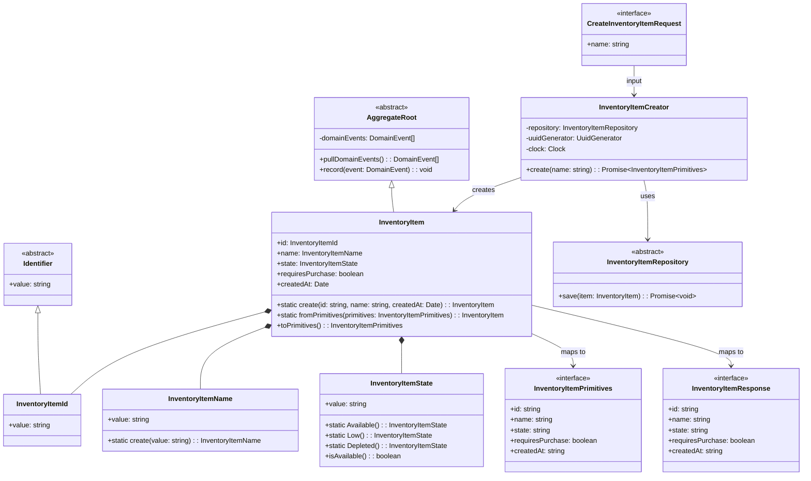

# Create Inventory Item API

## Requirements

Implement a low-friction inventory registration endpoint that allows users to add products to their pantry with minimal input. The system adopts a qualitative state model ("Available", "Low", "Depleted") instead of exact quantities, reducing user cognitive load and abandonment. Every new item defaults to "Available" state, assuming users register products they have on hand.

## Entities



## Approach

1. **Bounded Context Design**:
   - Create new `inventory` bounded context under `src/contexts/inventory/inventory-items/`
   - Follow existing hexagonal architecture: domain → application → infrastructure
   - Mirror the `cooked-dishes` module structure for consistency

2. **Domain Modeling**:
   - `InventoryItem` aggregate with value objects for identity, name, and state
   - `InventoryItemState` as constrained value object with static factory methods
   - `requiresPurchase` derived from state: `false` when "Available", `true` otherwise
   - Name validation at domain level via `InventoryItemName` value object

3. **API Design**:
   - POST `/api/inventory/items` endpoint
   - Request body: `{ "name": "string" }`
   - Response 201: full item primitives including generated UUID and timestamp
   - Response 400: validation error for empty/whitespace name

4. **Infrastructure**:
   - PostgreSQL table `inventory.inventory_items` in new schema
   - Repository extends `PostgresRepository<InventoryItem>`
   - Clock interface for testable timestamp generation

## Structure

### Inheritance Relationships
1. `InventoryItemRepository` abstract class defines persistence contract
2. `PostgresInventoryItemRepository` implements `InventoryItemRepository`
3. `InventoryItem` extends `AggregateRoot` class
4. `InventoryItemId` extends `Identifier` class
5. `InventoryItemName` extends `StringValueObject` class
6. `InventoryItemState` extends `StringValueObject` class

### Dependencies
1. `InventoryItemCreator` depends on `InventoryItemRepository`, `UuidGenerator`, `Clock`
2. API route depends on `InventoryItemCreator`
3. `PostgresInventoryItemRepository` depends on `PostgresConnection`

### Layered Architecture
1. **API Layer** (`src/app/api/inventory/items/route.ts`): Request parsing, validation, HTTP response mapping
2. **Application Layer** (`InventoryItemCreator`): Orchestrates creation flow, coordinates dependencies
3. **Domain Layer** (`InventoryItem`, value objects, repository interface): Business rules, invariants
4. **Infrastructure Layer** (`PostgresInventoryItemRepository`): Persistence implementation

## Operations

### Create Value Object - InventoryItemId
1. **File**: `src/contexts/inventory/inventory-items/domain/InventoryItemId.ts`
2. **Responsibility**: Identifier for inventory items
3. **Implementation**:
   ```typescript
   import { Identifier } from "../../../shared/domain/Identifier";
   export class InventoryItemId extends Identifier {}
   ```

### Create Value Object - InventoryItemName
1. **File**: `src/contexts/inventory/inventory-items/domain/InventoryItemName.ts`
2. **Responsibility**: Validated product name with non-empty constraint
3. **Attributes**:
   - `value: string` - trimmed product name
4. **Methods**:
   - `static create(value: string): InventoryItemName`
     - Logic:
       - Trim input whitespace
       - If trimmed value is empty, throw `InvalidInventoryItemNameError`
       - If length exceeds 255 characters, throw `InvalidInventoryItemNameError`
       - Return new `InventoryItemName(trimmedValue)`
5. **Constraints**: Non-empty after trim, max 255 characters

### Create Value Object - InventoryItemState
1. **File**: `src/contexts/inventory/inventory-items/domain/InventoryItemState.ts`
2. **Responsibility**: Qualitative stock state with constrained values
3. **Attributes**:
   - `value: string` - one of "Available", "Low", "Depleted"
4. **Methods**:
   - `static Available(): InventoryItemState` - returns state "Available"
   - `static Low(): InventoryItemState` - returns state "Low"
   - `static Depleted(): InventoryItemState` - returns state "Depleted"
   - `static fromValue(value: string): InventoryItemState` - factory from string
   - `isAvailable(): boolean` - returns true if state is "Available"
   - `derivesRequiresPurchase(): boolean` - returns `!this.isAvailable()`
5. **Constraints**: Value must be one of the three allowed states

### Create Domain Error - InvalidInventoryItemNameError
1. **File**: `src/contexts/inventory/inventory-items/domain/InvalidInventoryItemNameError.ts`
2. **Responsibility**: Domain error for invalid product names
3. **Implementation**:
   - Extend `CodelyError`
   - Error type: `InvalidInventoryItemName`
   - Include attempted name in params

### Create Aggregate - InventoryItem
1. **File**: `src/contexts/inventory/inventory-items/domain/InventoryItem.ts`
2. **Responsibility**: Core aggregate representing a pantry product
3. **Attributes**:
   - `id: InventoryItemId`
   - `name: InventoryItemName`
   - `state: InventoryItemState`
   - `createdAt: Date`
4. **Methods**:
   - `static create(id: string, name: string, createdAt: Date): InventoryItem`
     - Logic:
       - Create `InventoryItemId` from id string
       - Create `InventoryItemName.create(name)` - throws if invalid
       - Set state to `InventoryItemState.Available()`
       - Return new aggregate instance
   - `static fromPrimitives(primitives: InventoryItemPrimitives): InventoryItem`
     - Logic: Reconstruct aggregate from database primitives
   - `toPrimitives(): InventoryItemPrimitives`
     - Logic: Return plain object with id, name, state, requiresPurchase, createdAt (ISO string)
   - `get requiresPurchase(): boolean`
     - Logic: Return `this.state.derivesRequiresPurchase()`

### Create Repository Interface - InventoryItemRepository
1. **File**: `src/contexts/inventory/inventory-items/domain/InventoryItemRepository.ts`
2. **Responsibility**: Persistence contract for inventory items
3. **Methods**:
   - `save(item: InventoryItem): Promise<void>`

### Create Application Service - InventoryItemCreator
1. **File**: `src/contexts/inventory/inventory-items/application/create/InventoryItemCreator.ts`
2. **Responsibility**: Orchestrate inventory item creation
3. **Dependencies**: `InventoryItemRepository`, `UuidGenerator`, `Clock`
4. **Methods**:
   - `create(name: string): Promise<InventoryItemPrimitives>`
     - Logic:
       - Generate UUID via `uuidGenerator.generate()`
       - Get current time via `clock.now()`
       - Create aggregate: `InventoryItem.create(id, name, createdAt)`
       - Persist: `await repository.save(item)`
       - Return `item.toPrimitives()`
5. **Annotations**: `@Service()`

### Create Infrastructure - PostgresInventoryItemRepository
1. **File**: `src/contexts/inventory/inventory-items/infrastructure/PostgresInventoryItemRepository.ts`
2. **Responsibility**: PostgreSQL persistence for inventory items
3. **Methods**:
   - `save(item: InventoryItem): Promise<void>`
     - Logic:
       - Get primitives from item
       - Execute INSERT into `inventory.inventory_items`
       - Columns: id, name, state, requires_purchase, created_at
   - `toAggregate(row: Row): InventoryItem`
     - Logic: Map database row to aggregate via `fromPrimitives`
4. **Annotations**: `@Service()`

### Create API Route - POST /api/inventory/items
1. **File**: `src/app/api/inventory/items/route.ts`
2. **Responsibility**: HTTP endpoint for item creation
3. **Implementation**:
   - Import `reflect-metadata` at top
   - Get `InventoryItemCreator` from DI container
   - Parse JSON body, extract `name`
   - Call `creator.create(name)`
   - Return `HttpNextResponse.created()` with primitives (201)
   - Catch `InvalidInventoryItemNameError`: return `HttpNextResponse.badRequest("El nombre del producto es obligatorio")` (400)

### Create Clock Implementation - SystemClock
1. **File**: `src/contexts/shared/infrastructure/SystemClock.ts`
2. **Responsibility**: Production clock implementation
3. **Methods**:
   - `now(): Date` - returns `new Date()`
4. **Annotations**: `@Service()`

### Update DI Configuration
1. **File**: `src/contexts/shared/infrastructure/dependency-injection/diod.config.ts`
2. **Changes**:
   - Import new classes
   - Register `Clock` interface with `SystemClock` implementation
   - Register `InventoryItemRepository` with `PostgresInventoryItemRepository`
   - Register `InventoryItemCreator`

### Create Database Migration
1. **File**: `migrations/XXXXXX_create_inventory_items.sql`
2. **Content**:
   ```sql
   CREATE SCHEMA IF NOT EXISTS inventory;
   
   CREATE TABLE inventory.inventory_items (
       id UUID PRIMARY KEY,
       name VARCHAR(255) NOT NULL,
       state VARCHAR(20) NOT NULL DEFAULT 'Available',
       requires_purchase BOOLEAN NOT NULL DEFAULT FALSE,
       created_at TIMESTAMPTZ NOT NULL DEFAULT NOW()
   );
   ```

## Norms

1. **File Organization**:
   - Domain: `src/contexts/inventory/inventory-items/domain/`
   - Application: `src/contexts/inventory/inventory-items/application/create/`
   - Infrastructure: `src/contexts/inventory/inventory-items/infrastructure/`

2. **Naming Conventions**:
   - Aggregates: `{Entity}.ts`
   - Value Objects: `{Entity}{Property}.ts`
   - Repositories: `{Entity}Repository.ts` (interface), `Postgres{Entity}Repository.ts` (implementation)
   - Use Cases: `{Entity}{Action}.ts` (e.g., `InventoryItemCreator`)

3. **Dependency Injection**:
   - All services annotated with `@Service()` from `diod`
   - Abstract classes for repository interfaces
   - Register implementations in `diod.config.ts`

4. **API Routes**:
   - Must import `reflect-metadata` as first import
   - Get services from DI container at module level
   - Use `HttpNextResponse` for standardized responses

5. **Value Objects**:
   - Immutable with `readonly` properties
   - Static factory methods for construction with validation
   - `toPrimitives()` for serialization when needed

6. **Timestamps**:
   - Store as `TIMESTAMPTZ` in PostgreSQL
   - Serialize as ISO 8601 strings in API responses
   - Use `Clock` interface for testability

## Safeguards

1. **Functional Constraints**:
   - Only `name` accepted as input; state always defaults to "Available"
   - `requiresPurchase` is derived, not user-settable
   - No duplicate name validation (multiple items can share names)

2. **Input Validation**:
   - Name must be non-empty after whitespace trimming
   - Name maximum length: 255 characters
   - Whitespace-only names rejected with 400 error

3. **Response Format**:
   - Success (201): `{ id, name, state, requiresPurchase, createdAt }`
   - Error (400): `{ error: { type, description, params } }`

4. **State Constraints**:
   - Valid states: "Available", "Low", "Depleted"
   - New items always created as "Available"
   - State transitions handled by separate story (out of scope)

5. **Data Integrity**:
   - UUID generated server-side, never client-provided
   - Timestamp generated via Clock interface at creation time
   - All fields non-nullable in database

6. **API Contract**:
   - Endpoint: `POST /api/inventory/items`
   - Content-Type: `application/json`
   - Request body: `{ "name": "string" }`

7. **Out of Scope** (do not implement):
   - State transition endpoints
   - Item listing, search, deletion, or update
   - User authentication
   - Category management
