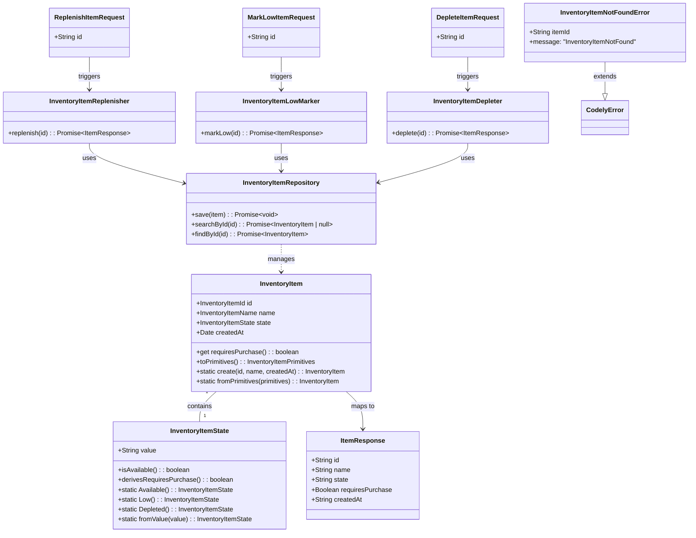

# Inventory Item State Transitions API

## Requirements

Implement three dedicated REST endpoints that enable users to transition inventory item states through semantic actions (replenish, mark-low, deplete) with automatic shopping list flag management, providing single-click state updates while maintaining domain integrity and returning complete updated item representations.

## Entities



## Approach

1. **API Design**:
   - Three dedicated POST endpoints with semantic URLs: `/api/inventory/items/{id}/replenish`, `/api/inventory/items/{id}/mark-low`, `/api/inventory/items/{id}/deplete`
   - Each endpoint follows Next.js App Router pattern with dynamic route segments
   - Consistent HTTP response codes: 200 for successful transitions, 404 for non-existent items
   - Unified error response format using existing `HttpNextResponse.notFound()` pattern

2. **Application Service Architecture**:
   - Three separate application services (InventoryItemReplenisher, InventoryItemLowMarker, InventoryItemDepleter) following SRP
   - Each service orchestrates: retrieve by ID → create new aggregate with updated state → persist → return primitives
   - Immutable aggregate pattern: create new instance with updated state rather than mutate existing
   - Domain-specific error handling with InventoryItemNotFoundError for not-found scenarios

3. **Repository Enhancement**:
   - Add `searchById(id: string): Promise<InventoryItem | null>` to InventoryItemRepository interface (optional retrieval, returns null if not found)
   - Add `findById(id: string): Promise<InventoryItem>` to InventoryItemRepository interface (required retrieval, throws InventoryItemNotFoundError if not found)
   - Modify existing `save(item: InventoryItem): Promise<void>` to handle both INSERT and UPDATE operations (smart save)
   - PostgresInventoryItemRepository implements searchById and findById using existing searchOne() template method
   - findById throws InventoryItemNotFoundError when searchById returns null (fail-fast for required aggregates)
   - Smart save uses PostgreSQL `INSERT ... ON CONFLICT DO UPDATE` (upsert) to handle both create and update scenarios
   - When item exists (UUID already in database): UPDATE statement modifies state and requires_purchase columns
   - When item doesn't exist: INSERT statement creates new row (fallback for edge cases)

4. **Business Logic**:
   - State-to-purchase-flag derivation enforced by domain: `InventoryItemState.derivesRequiresPurchase()` returns false only for "Available"
   - Idempotent transitions: transitioning to same state succeeds without error (e.g., replenish already-available item)
   - No state machine validation: any state can transition to any other state per scope exclusions
   - Automatic shopping list management via requires_purchase flag derived from state

5. **Error Handling Strategy**:
   - Domain error: InventoryItemNotFoundError extends CodelyError with item ID parameter
   - Application layer catches null from searchById() and throws domain error
   - API route layer catches domain error and returns HttpNextResponse.notFound()
   - Consistent error response format: `{error: {type: "InventoryItemNotFound", description: "...", params: {id}}}`

## Structure

### Inheritance Relationships

1. **InventoryItemNotFoundError extends CodelyError**: Domain error for not-found scenarios following existing error pattern
2. **InventoryItem extends AggregateRoot**: Aggregate root with domain event support (currently unused, reserved for future)
3. **PostgresInventoryItemRepository extends PostgresRepository**: Inherits searchOne(), searchMany(), execute() template methods
4. **InventoryItemState extends StringValueObject**: Value object with constrained valid states

### Dependencies

1. **API Route Layer → Application Layer**:
   - `/api/inventory/items/[id]/replenish/route.ts` injects InventoryItemReplenisher
   - `/api/inventory/items/[id]/mark-low/route.ts` injects InventoryItemLowMarker
   - `/api/inventory/items/[id]/deplete/route.ts` injects InventoryItemDepleter

2. **Application Services → Repository**:
   - InventoryItemReplenisher depends on InventoryItemRepository
   - InventoryItemLowMarker depends on InventoryItemRepository
   - InventoryItemDepleter depends on InventoryItemRepository

3. **Repository → Database**:
   - PostgresInventoryItemRepository uses PostgresConnection for SQL execution
   - UPDATE query targets inventory.inventory_items table

### Layered Architecture

1. **Controller Layer (API Routes)**:
   - Extract ID from URL path parameter
   - Delegate to appropriate application service
   - Handle domain errors and return appropriate HTTP responses
   - Return updated item primitives on success

2. **Application Layer (Use Cases)**:
   - Orchestrate read-then-write flow: retrieve → modify → persist
   - Create new aggregate instance with updated state (immutable approach)
   - Throw domain errors for not-found scenarios
   - Return complete item primitives to API layer

3. **Repository Layer (Domain Interface)**:
   - Abstract interface InventoryItemRepository defines searchById(), findById(), and save() contracts
   - PostgresInventoryItemRepository implements concrete PostgreSQL operations
   - searchById() returns null if item not found (used when aggregate existence is optional)
   - findById() throws InventoryItemNotFoundError if item not found (used when aggregate must exist - fail-fast principle)
   - save() handles both INSERT (new items) and UPDATE (existing items) via upsert logic

4. **Data Access Layer (Infrastructure)**:
   - PostgresConnection manages SQL connection pool
   - save() uses `INSERT ... ON CONFLICT DO UPDATE` for upsert semantics
   - Row-to-aggregate mapping via toAggregate() used by searchById(), not by save()

5. **Domain Layer**:
   - InventoryItem aggregate owns state transition logic via fromPrimitives() factory
   - InventoryItemState value object enforces valid state values
   - requiresPurchase flag derived from state via derivesRequiresPurchase() business logic

## Operations

### Create Domain Error - InventoryItemNotFoundError

1. **File**: `src/contexts/inventory/inventory-items/domain/InventoryItemNotFoundError.ts`
2. **Responsibility**: Domain error representing inventory item not found scenarios
3. **Attributes**:
   - `itemId`: string - The ID that was not found
4. **Methods**:
   - `constructor(itemId: string)`: Initialize with item ID parameter
   - `override get message(): string`: Return "InventoryItemNotFound"
   - `toPrimitives()`: Inherited from CodelyError, returns {type, params}
5. **Inheritance**: Extends CodelyError
6. **Usage Scenarios**: Repository.findById() throws automatically when item not found; application services propagate the error

### Enhance Domain Repository Interface - InventoryItemRepository

1. **File**: `src/contexts/inventory/inventory-items/domain/InventoryItemRepository.ts`
2. **Add Methods**:
   - `searchById(id: string): Promise<InventoryItem | null>`: Retrieve single item by UUID, returns null if not found (optional retrieval)
   - `findById(id: string): Promise<InventoryItem>`: Retrieve single item by UUID, throws InventoryItemNotFoundError if not found (required retrieval)
3. **Method Signatures**:
   ```typescript
   abstract searchById(id: string): Promise<InventoryItem | null>;
   abstract findById(id: string): Promise<InventoryItem>;
   ```
4. **Note**: Existing `save(item: InventoryItem): Promise<void>` method remains unchanged (interface already has it)

### Implement Repository Methods - PostgresInventoryItemRepository

1. **File**: `src/contexts/inventory/inventory-items/infrastructure/PostgresInventoryItemRepository.ts`
2. **Add searchById Implementation**:
   - Use inherited `searchOne()` template method from PostgresRepository
   - SQL query: `SELECT id, name, state, requires_purchase, created_at FROM inventory.inventory_items WHERE id = ${id}`
   - Leverages existing `toAggregate()` for row-to-object mapping
   - Returns null if no rows found (query returns empty array)
   - Logic: `return await this.searchOne`SELECT * FROM inventory.inventory_items WHERE id = ${id}`;`

3. **Add findById Implementation**:
   - Calls `searchById(id)` internally
   - If result is null, throws `new InventoryItemNotFoundError(id)`
   - Otherwise returns the found aggregate
   - Logic:
     ```typescript
     async findById(id: string): Promise<InventoryItem> {
         const item = await this.searchById(id);
         if (item === null) {
             throw new InventoryItemNotFoundError(id);
         }
         return item;
     }
     ```

3. **Modify save Implementation** (replace existing INSERT-only with smart upsert):
   - Replace existing `save()` method (currently uses only INSERT)
   - Extract primitives via `item.toPrimitives()`
   - Use PostgreSQL `INSERT ... ON CONFLICT DO UPDATE` (upsert syntax)
   - SQL query:
     ```typescript
     await this.execute`
       INSERT INTO inventory.inventory_items (id, name, state, requires_purchase, created_at)
       VALUES (${primitives.id}, ${primitives.name}, ${primitives.state}, ${primitives.requiresPurchase}, ${primitives.createdAt})
       ON CONFLICT (id) DO UPDATE SET
         state = EXCLUDED.state,
         requires_purchase = EXCLUDED.requires_purchase
     `;
     ```
   - No return value (void)
   - Handles both new items (INSERT) and existing items (UPDATE on conflict)
   - Only updates mutable columns (state, requires_purchase), preserves created_at

### Create Application Service - InventoryItemReplenisher

1. **File**: `src/contexts/inventory/inventory-items/application/replenish/InventoryItemReplenisher.ts`
2. **Annotation**: `@Service()`
3. **Interface**: None (concrete class with public method)
4. **Core Method**:
   - `async replenish(id: string): Promise<InventoryItemPrimitives>`

5. **Method Logic**:
   - **Input Validation**: Not required (ID validated by database UUID type)
   - **Business Logic**:
     1. Call `repository.findById(id)` to retrieve existing item (throws InventoryItemNotFoundError if not found)
     2. Extract primitives from existing item via `existing.toPrimitives()`
     3. Create new aggregate with updated state: `InventoryItem.fromPrimitives({...existingPrimitives, state: "Available"})`
     4. Domain automatically sets `requiresPurchase: false` via `InventoryItemState.Available().derivesRequiresPurchase()`
     5. Call `repository.save(updatedItem)` to persist changes
     6. Return `updatedItem.toPrimitives()` for API response
   - **Exception Handling**: Propagates InventoryItemNotFoundError from repository.findById()
   - **Return Value**: Complete item primitives with updated state and requiresPurchase flag

6. **Dependency Injection**:
   - Constructor injection of `InventoryItemRepository`

7. **Transaction Management**: Single UPDATE operation, no multi-step transactions required

### Create Application Service - InventoryItemLowMarker

1. **File**: `src/contexts/inventory/inventory-items/application/mark-low/InventoryItemLowMarker.ts`
2. **Annotation**: `@Service()`
3. **Core Method**:
   - `async markLow(id: string): Promise<InventoryItemPrimitives>`

4. **Method Logic**:
   - **Input Validation**: Not required
   - **Business Logic**:
     1. Call `repository.findById(id)` to retrieve existing item (throws InventoryItemNotFoundError if not found)
     2. Extract primitives from existing item
     3. Create new aggregate: `InventoryItem.fromPrimitives({...existingPrimitives, state: "Low"})`
     4. Domain automatically sets `requiresPurchase: true` via `InventoryItemState.Low().derivesRequiresPurchase()`
     5. Call `repository.save(updatedItem)`
     6. Return `updatedItem.toPrimitives()`
   - **Exception Handling**: Propagates InventoryItemNotFoundError from repository.findById()
   - **Return Value**: Complete item primitives

5. **Dependency Injection**:
   - Constructor injection of `InventoryItemRepository`

### Create Application Service - InventoryItemDepleter

1. **File**: `src/contexts/inventory/inventory-items/application/deplete/InventoryItemDepleter.ts`
2. **Annotation**: `@Service()`
3. **Core Method**:
   - `async deplete(id: string): Promise<InventoryItemPrimitives>`

4. **Method Logic**:
   - **Input Validation**: Not required
   - **Business Logic**:
     1. Call `repository.findById(id)` to retrieve existing item (throws InventoryItemNotFoundError if not found)
     2. Extract primitives from existing item
     3. Create new aggregate: `InventoryItem.fromPrimitives({...existingPrimitives, state: "Depleted"})`
     4. Domain automatically sets `requiresPurchase: true` via `InventoryItemState.Depleted().derivesRequiresPurchase()`
     5. Call `repository.save(updatedItem)`
     6. Return `updatedItem.toPrimitives()`
   - **Exception Handling**: Propagates InventoryItemNotFoundError from repository.findById()
   - **Return Value**: Complete item primitives

5. **Dependency Injection**:
   - Constructor injection of `InventoryItemRepository`

### Create API Route - Replenish Route Handler

1. **File**: `src/app/api/inventory/items/[id]/replenish/route.ts`
2. **Top Import**: `import "reflect-metadata";` (required for DIOD)
3. **Handler**:
   - `export async function POST(request: NextRequest, { params }: { params: { id: string } }): Promise<NextResponse>`

4. **Method Logic**:
   - Extract ID from params: `const id = params.id`
   - Delegate to application service: `const item = await replenisher.replenish(id)`
   - Return success response: `return HttpNextResponse.ok(item)`
   - **Exception Handling**:
     - Catch InventoryItemNotFoundError, return `HttpNextResponse.notFound()` (or custom with ID in params)
     - Catch CodelyError, return `HttpNextResponse.codelyError(error, 404)`
     - Re-throw unexpected errors

5. **Service Injection**:
   - `const replenisher = container.get(InventoryItemReplenisher);`

6. **Response Format**: JSON with item primitives (id, name, state, requiresPurchase, createdAt)

### Create API Route - Mark Low Route Handler

1. **File**: `src/app/api/inventory/items/[id]/mark-low/route.ts`
2. **Top Import**: `import "reflect-metadata";`
3. **Handler**:
   - `export async function POST(request: NextRequest, { params }: { params: { id: string } }): Promise<NextResponse>`

4. **Method Logic**:
   - Extract ID from params: `const id = params.id`
   - Delegate: `const item = await lowMarker.markLow(id)`
   - Return success: `return HttpNextResponse.ok(item)`
   - **Exception Handling**: Same pattern as replenish route

5. **Service Injection**:
   - `const lowMarker = container.get(InventoryItemLowMarker);`

### Create API Route - Deplete Route Handler

1. **File**: `src/app/api/inventory/items/[id]/deplete/route.ts`
2. **Top Import**: `import "reflect-metadata";`
3. **Handler**:
   - `export async function POST(request: NextRequest, { params }: { params: { id: string } }): Promise<NextResponse>`

4. **Method Logic**:
   - Extract ID from params: `const id = params.id`
   - Delegate: `const item = await depleter.deplete(id)`
   - Return success: `return HttpNextResponse.ok(item)`
   - **Exception Handling**: Same pattern as replenish route

5. **Service Injection**:
   - `const depleter = container.get(InventoryItemDepleter);`

### Update DI Container Configuration

1. **File**: `src/contexts/shared/infrastructure/dependency-injection/diod.config.ts`
2. **Add Imports**:
   - `import { InventoryItemReplenisher } from "../../../inventory/inventory-items/application/replenish/InventoryItemReplenisher";`
   - `import { InventoryItemLowMarker } from "../../../inventory/inventory-items/application/mark-low/InventoryItemLowMarker";`
   - `import { InventoryItemDepleter } from "../../../inventory/inventory-items/application/deplete/InventoryItemDepleter";`

3. **Add Registrations**:
   - `builder.registerAndUse(InventoryItemReplenisher);`
   - `builder.registerAndUse(InventoryItemLowMarker);`
   - `builder.registerAndUse(InventoryItemDepleter);`

4. **Placement**: After existing InventoryItemCreator registration, maintain grouping under "// Inventory - InventoryItem" section

### Create Test Object Mother - InventoryItemMother

1. **File**: `tests/contexts/inventory/inventory-items/domain/InventoryItemMother.ts`
2. **Responsibility**: Generate test InventoryItem instances with configurable or random values
3. **Static Method**:
   - `static create(params?: Partial<InventoryItemPrimitives>): InventoryItem`
4. **Dependencies**:
   - `import { faker } from "@faker-js/faker";`
   - Use existing InventoryItemIdMother if available, otherwise use faker.string.uuid()
5. **Default Primitives**:
   ```typescript
   const primitives: InventoryItemPrimitives = {
       id: faker.string.uuid(),
       name: faker.commerce.productName(),
       state: "Available", // or use EnumMother
       requiresPurchase: false,
       createdAt: faker.date.recent().toISOString(),
       ...params,
   };
   return InventoryItem.fromPrimitives(primitives);
   ```

### Create Mock Repository - MockInventoryItemRepository

1. **File**: `tests/contexts/inventory/inventory-items/infrastructure/MockInventoryItemRepository.ts`
2. **Responsibility**: Test double implementing InventoryItemRepository with in-memory storage and assertion methods
3. **Attributes**:
   - `private items: Map<string, InventoryItem>`: In-memory storage
   - `private savedItems: InventoryItem[]`: Track calls to save() for assertions
   - `private findByIdMock: Map<string, InventoryItem | null>`: Mock return values for findById() testing
4. **Methods**:
   - `async save(item: InventoryItem): Promise<void>`: Store/replace in items map, add to savedItems
   - `async searchById(id: string): Promise<InventoryItem | null>`: Return item from map or null
   - `async findById(id: string): Promise<InventoryItem>`: Return item from findByIdMock or items map, throw InventoryItemNotFoundError if null
   - `shouldSave(expectedItem: InventoryItem)`: Setup assertion for save() call
   - `shouldSearchById(id: string, mockItem: InventoryItem | null)`: Setup mock return for searchById
   - `shouldFindById(id: string, mockItem: InventoryItem | null)`: Setup mock return for findById (null will throw error)
   - `verify()`: Assert that expected save() calls occurred

### Create Unit Tests - InventoryItemReplenisher Tests

1. **File**: `tests/contexts/inventory/inventory-items/application/replenish/InventoryItemReplenisher.test.ts`
2. **Test Structure**:
   ```typescript
   describe("InventoryItemReplenisher should", () => {
       const repository = new MockInventoryItemRepository();
       const replenisher = new InventoryItemReplenisher(repository);

       it("replenish depleted item to available state", async () => {
           // Arrange
           const existingItem = InventoryItemMother.create({
               state: "Depleted",
               requiresPurchase: true
           });
           repository.shouldFindById(existingItem.id.value, existingItem);

           // Act
           const result = await replenisher.replenish(existingItem.id.value);

           // Assert
           expect(result.state).toBe("Available");
           expect(result.requiresPurchase).toBe(false);
           repository.verify();
       });

       it("throw InventoryItemNotFoundError when item not found", async () => {
           // Arrange
           const nonExistentId = faker.string.uuid();
           repository.shouldFindById(nonExistentId, null); // Will throw error

           // Act & Assert
           await expect(replenisher.replenish(nonExistentId))
               .rejects.toThrow(InventoryItemNotFoundError);
       });
   });
   ```

### Create Unit Tests - InventoryItemLowMarker Tests

1. **File**: `tests/contexts/inventory/inventory-items/application/mark-low/InventoryItemLowMarker.test.ts`
2. **Test Cases**:
   - Mark available item as low (state changes, requiresPurchase becomes true)
   - Mark already low item as low (idempotent, succeeds without error)
   - Return 404 when item not found

### Create Unit Tests - InventoryItemDepleter Tests

1. **File**: `tests/contexts/inventory/inventory-items/application/deplete/InventoryItemDepleter.test.ts`
2. **Test Cases**:
   - Deplete available item (state changes to Depleted, requiresPurchase becomes true)
   - Deplete low item (state changes to Depleted, requiresPurchase remains true)
   - Deplete already depleted item (idempotent, succeeds without error)
   - Return 404 when item not found

### Create API Integration Tests

1. **File**: `tests/api/inventory/items/replenish.test.ts` (similar for mark-low and deplete)
2. **Tool**: Use `next-test-api-route-handler` (already in dependencies per analysis)
3. **Test Structure**:
   ```typescript
   import { createMocks } from 'node-mocks-http';
   import handler from '@/app/api/inventory/items/[id]/replenish/route';

   describe("POST /api/inventory/items/:id/replenish", () => {
       it("returns 200 with updated item", async () => {
           // Setup test data in database
           // Call handler with mock request
           // Assert response status and body
       });
   });
   ```

## Norms

1. **Annotation Standards**:
   - Application services: `@Service()` decorator for DIOD registration
   - All API routes: Top-level `import "reflect-metadata";` for DIOD decorator support
   - Repository implementations: `@Service()` decorator in PostgresInventoryItemRepository (already present)

2. **Dependency Injection Patterns**:
   - Constructor injection for all service dependencies
   - Use `container.get(ServiceClass)` in API routes (manual resolution, no framework injection in Next.js)
   - Register services in diod.config.ts using `builder.registerAndUse(ServiceClass)`
   - Repository registration: `builder.register(Interface).use(Implementation)` then `builder.registerAndUse(Implementation)`

3. **Exception Handling**:
   - Domain errors extend `CodelyError` base class
   - Domain errors must include `message` getter returning error type string
   - Domain errors include relevant parameters via constructor (e.g., itemId)
   - Application services throw domain errors (not HTTP exceptions)
   - API routes catch domain errors and return appropriate HTTP responses via `HttpNextResponse`
   - Use `HttpNextResponse.codelyError(error, statusCode)` for CodelyError instances
   - Use `HttpNextResponse.notFound()` for not-found scenarios

4. **Data Validation**:
   - ID validation performed by database UUID type (no pre-validation required)
   - State validation performed by InventoryItemState.fromValue() domain logic
   - No manual DTO validation for request bodies (no body in these endpoints)

5. **Logging Standards**:
   - No logging requirements specified for this feature
   - Follow existing project pattern if logging exists (currently not observed)

6. **Documentation Standards**:
   - JSDoc comments optional (not present in existing codebase)
   - Method names should be self-descriptive (replenish, markLow, deplete)
   - File names follow feature-action pattern: `/replenish/InventoryItemReplenisher.ts`

7. **Testing Standards**:
   - Unit tests use mock repositories (MockInventoryItemRepository)
   - Test instances created via Object Mothers (InventoryItemMother)
   - Use `describe`/`it` pattern with descriptive test names
   - AAA pattern: Arrange (setup), Act (execute), Assert (verify)
   - Verify repository interactions via mock assertions (shouldSave, shouldSearchById)

8. **Response Format Standards**:
   - Success responses: JSON with complete item primitives via `HttpNextResponse.ok(data)`
   - Error responses: `{error: {type, description, params}}` structure via HttpNextResponse methods
   - Consistent response structure across all three endpoints

9. **Immutable Aggregate Pattern**:
   - Never mutate existing aggregate instances
   - Always create new instance via `InventoryItem.fromPrimitives()` with updated values
   - Leverage readonly fields in constructor to enforce immutability

10. **Repository Method Naming**:
    - Read methods: `search*` prefix returns nullable results (searchById, searchMany, searchOne) - use when aggregate existence is optional
    - Read methods: `find*` prefix throws domain error if not found (findById) - use when aggregate must exist (fail-fast principle)
    - Write methods: `save` for both INSERT and UPDATE (smart upsert using `INSERT ... ON CONFLICT DO UPDATE`)
    - No separate `update()` method needed - `save()` handles both scenarios

## Safeguards

1. **Functional Constraints**:
   - All three endpoints require valid UUID in URL path parameter (malformed UUID returns 404 via database query)
   - State transitions are idempotent: transitioning to same state must succeed without error (AC6)
   - requires_purchase flag is derived from state and cannot be set independently
   - Only three valid states: "Available", "Low", "Depleted" (enforced by InventoryItemState domain logic)
   - Any state can transition to any other state (no state machine validation per scope exclusions)

2. **Performance Constraints**:
   - Each endpoint must complete single UPDATE operation within 100ms (typical PostgreSQL single-row update)
   - No N+1 query patterns: single searchById + single UPDATE per request
   - No unnecessary database calls: retrieve item once, update once

3. **Security Constraints**:
   - No authentication required (not specified in requirements)
   - Input sanitization handled by parameterized SQL queries (postgres library template strings)
   - No SQL injection risk (uses prepared statements via sql template tag)
   - Error responses do not expose sensitive system information (only type and description)

4. **Integration Constraints**:
   - Database table `inventory.inventory_items` must exist with columns: id UUID, state VARCHAR, requires_purchase BOOLEAN
   - UUID type validation performed by PostgreSQL (no application-side format validation)
   - No external service integrations required (database only)

5. **Business Rule Constraints**:
   - State "Available" MUST have requires_purchase = false (enforced by domain logic)
   - State "Low" MUST have requires_purchase = true (enforced by domain logic)
   - State "Depleted" MUST have requires_purchase = true (enforced by domain logic)
   - Invalid state values throw Error from InventoryItemState.fromValue()
   - Non-existent item IDs MUST return HTTP 404 (AC7, AC8, AC9)

6. **Exception Handling Constraints**:
   - InventoryItemNotFoundError MUST include itemId in params for debugging
   - All business exceptions MUST be caught in API route layer
   - Exceptions MUST NOT propagate to HTTP response (caught and converted to appropriate responses)
   - Domain errors MUST extend CodelyError base class
   - Repository.findById() throws InventoryItemNotFoundError when item not found (fail-fast principle)
   - Application services propagate InventoryItemNotFoundError from repository, no null-checking required

7. **Technical Constraints**:
   - Next.js App Router file structure must follow pattern: `/api/inventory/items/[id]/action/route.ts`
   - All API routes must import "reflect-metadata" at top of file
   - TypeScript strict mode with decorators enabled (already configured)
   - DIOD container must be configured with all services before app startup

8. **Data Constraints**:
   - ID must be valid UUID string (enforced by PostgreSQL UUID column type)
   - State must be one of: "Available", "Low", "Depleted" (enforced by InventoryItemState)
   - requires_purchase must be boolean (enforced by PostgreSQL BOOLEAN column type)
   - created_at must be valid ISO 8601 timestamp string (existing data constraint)

9. **API Constraints**:
   - POST method required (not PUT) for semantic action endpoints
   - Request body must be empty (no parameters in body, only ID in URL)
   - Response must be JSON with Content-Type: application/json
   - Success response: HTTP 200 with complete item primitives
   - Not found response: HTTP 404 with error structure
   - No other status codes returned (200 for success, 404 for not found)

10. **Concurrency Constraints**:
    - Last write wins for simultaneous state updates (no optimistic locking required per analysis assumptions)
    - No transaction boundaries required (single UPDATE operation is atomic)
    - Race condition: item deleted between searchById and UPDATE treated as 404 (UPDATE affects 0 rows)

11. **Testing Constraints**:
    - Unit tests must use mock repositories, not real database connections
    - Integration tests must use test database (not production)
    - Test data must use Object Mothers for consistency
    - All acceptance criteria (AC1-AC9) must have corresponding test cases
