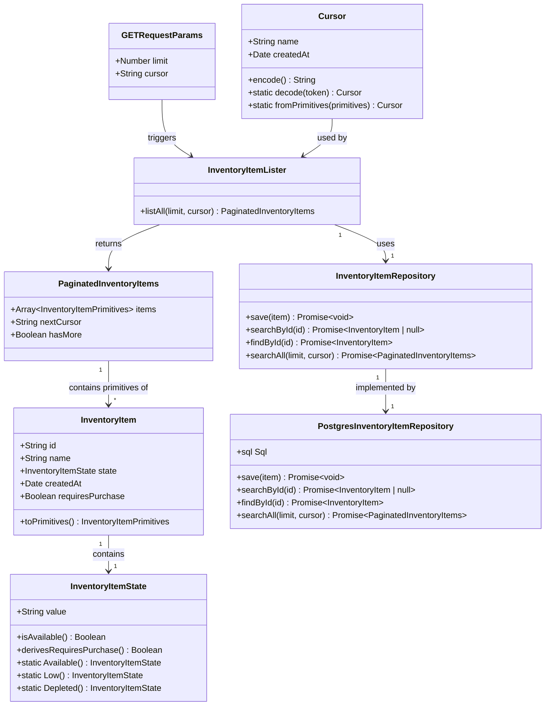

# [STORY-001-003] List All Inventory Products with Cursor-Based Pagination

## Requirements
Implement a read-only list operation for inventory items that provides complete pantry visibility through alphabetical ordering and cursor-based infinite scroll pagination, enabling users to view all products regardless of state while supporting efficient navigation through large inventories without traditional pagination limitations.

## Entities

## Approach
1. **API Design Pattern**:
   - Extend existing `/api/inventory/items` route to support GET method alongside current POST
   - Follow REST conventions: GET for collection retrieval, POST for creation
   - Implement cursor-based pagination using opaque tokens for infinite scroll experience
   - Return structured response with `items`, `nextCursor`, and `hasMore` metadata

2. **Technical Implementation**:
   - **Framework**: Next.js 16 API Routes with TypeScript strict mode
   - **Architecture**: Hexagonal/DDD pattern with clear layer separation (Controller → Application → Repository → Database)
   - **Pagination Strategy**: Composite keyset cursor using `[name, created_at]` for correct alphabetical ordering
   - **Cursor Encoding**: Base64-encoded JSON to make implementation details opaque
   - **Performance**: Single-query pagination with composite index on `(name, created_at)`
   - **Exception Handling**: Custom domain exceptions with unified HttpNextResponse error handling

3. **Business Logic**:
   - **Core Rule**: Return ALL products regardless of state or `requires_purchase` value (no filtering)
   - **Alphabetical Ordering**: Primary sort by `name` ASC, secondary by `created_at` for uniqueness
   - **Default Behavior**: Default `limit=20`, return first page when no cursor provided
   - **Empty Inventory**: Return empty array with `nextCursor: null` and `hasMore: false` (not 404)
   - **Cursor Validation**: Reject malformed cursors with 400 Bad Request, decode safely with try-catch
   - **Limit Validation**: Validate `limit` parameter (1-100 range), default to 20 if invalid

## Structure

### Inheritance Relationships
1. **InventoryItemRepository** interface defines persistence contract for inventory items
2. **PostgresInventoryItemRepository** implements InventoryItemRepository interface, extends PostgresRepository~InventoryItem~
3. **InventoryItem** extends AggregateRoot base class from shared domain
4. **InventoryItemState** extends StringValueObject from shared domain
5. **Cursor** extends ValueObject base pattern (new value object)
6. **InvalidCursorError** extends Error or CodelyError base class (new domain exception)

### Dependencies
1. **API Route Handler** (`/api/inventory/items/route.ts`) calls InventoryItemLister
2. **InventoryItemLister** depends on InventoryItemRepository and Cursor value object
3. **PostgresInventoryItemRepository** depends on PostgresConnection and extends PostgresRepository
4. **InventoryItemLister** uses Cursor for encoding/decoding pagination tokens
5. **DI Container** (diod.config.ts) registers InventoryItemLister as @Service()

### Layered Architecture
1. **Controller Layer**: Next.js API route handler (`/api/inventory/items/route.ts`)
   - Responsibilities: Request parsing, parameter validation, response serialization
   - Handles HTTP concerns (status codes, content-type, error responses)

2. **Application Layer**: InventoryItemLister (`src/contexts/inventory/inventory-items/application/list/`)
   - Responsibilities: Orchestrate list retrieval, cursor decoding, response building
   - Contains business logic for pagination and empty inventory handling

3. **Domain Layer**: InventoryItem aggregate, InventoryItemState, Cursor value object
   - Responsibilities: Business rules, entity state management, value object validation
   - Enforces invariants (valid state values, cursor encoding rules)

4. **Repository Layer**: InventoryItemRepository interface, PostgresInventoryItemRepository implementation
   - Responsibilities: Data access, SQL query execution, aggregate reconstruction
   - Implements searchAll method with cursor-based pagination logic

5. **Infrastructure Layer**: PostgresConnection, HttpNextResponse
   - Responsibilities: Database connection management, HTTP response formatting
   - Provides cross-cutting utilities for persistence and API communication

6. **Exception Handling Layer**: Domain-specific exceptions with unified HttpNextResponse error handling
   - Responsibilities: Centralized error handling, consistent error response format
   - Maps domain exceptions to appropriate HTTP status codes

## Operations

### Create Value Object - Cursor
1. **Responsibility**: Encode and decode composite cursor tokens for pagination
2. **Attributes**:
   - `name`: String - Last seen product name for cursor continuation
   - `createdAt`: Date - Timestamp for uniqueness with duplicate names
3. **Methods**:
   - `encode(): String`
     - Logic: Serialize `{name, createdAt}` to JSON, then base64-encode
     - Error handling: Throws error if encoding fails (should not occur with valid data)
   - `static decode(token: String): Cursor`
     - Logic: Base64-decode token, parse JSON, validate structure, reconstruct Cursor
     - Conditional logic: Return null or throw InvalidCursorError if malformed
     - Error handling: Try-catch parsing, throw InvalidCursorError with descriptive message
   - `static fromPrimitives(primitives: {name: String, createdAt: String}): Cursor`
     - Logic: Validate name non-empty, parse createdAt as ISO string, create Cursor instance
     - Conditional logic: Throw error if name empty or createdAt invalid
4. **Annotations**: None (value object)
5. **Constraints**:
   - Name must be non-empty string
   - CreatedAt must be valid ISO 8601 date string
   - Encoded token must be base64 string (not encrypted, just opaque)

### Create DTO - PaginatedInventoryItems
1. **Responsibility**: Container for paginated list response with metadata
2. **Attributes**:
   - `items`: Array~InventoryItemPrimitives~ - Array of product data for current page
   - `nextCursor`: String | null - Opaque token for next page, null if no more results
   - `hasMore`: Boolean - Indicates whether additional pages exist
3. **Methods**:
   - `static empty(): PaginatedInventoryItems`
     - Logic: Return instance with empty items array, null nextCursor, false hasMore
   - `static fromItems(items: Array~InventoryItem~, nextCursor: String | null, hasMore: Boolean): PaginatedInventoryItems`
     - Logic: Map items to primitives, construct response with provided metadata
     - Conditional logic: Set nextCursor to null if hasMore is false
4. **Annotations**: None (simple DTO)
5. **Constraints**:
   - Items array cannot be null (use empty array instead)
   - nextCursor must be null when hasMore is false
   - nextCursor must be non-null when hasMore is true

### Create Domain Exception - InvalidCursorError
1. **Responsibility**: Represent malformed or invalid cursor tokens
2. **Attributes**:
   - `message`: String - Descriptive error message for debugging
   - `cursor`: String - The malformed cursor value (for debugging)
3. **Methods**:
   - `constructor(message: String, cursor: String)`
     - Logic: Store message and cursor for error reporting
4. **Inheritance**: Extends Error or CodelyError base class
5. **Usage Scenarios**: Thrown when client provides malformed base64 or invalid cursor structure

### Extend Repository Interface - InventoryItemRepository
1. **Interface Method Addition**:
   - Add method signature: `searchAll(limit: Number, cursor: String | null): Promise~PaginatedInventoryItems~`
   - Contract: Returns paginated results, handles null cursor as "first page" request
   - Return type: PaginatedInventoryItems with items array, nextCursor, hasMore flag

2. **Implementation in PostgresInventoryItemRepository**:
   - `async searchAll(limit: Number, cursor: String | null): Promise~PaginatedInventoryItems>`
     - **Input Validation**:
       - Validate limit between 1-100, default to 20 if invalid
       - Decode cursor using Cursor.decode() if provided, treat null as first page
       - Throw InvalidCursorError if cursor malformed
     - **Business Logic**:
       - Fetch limit + 1 items to determine if more pages exist
       - If cursor provided: Filter WHERE name > cursor.name OR (name = cursor.name AND created_at > cursor.createdAt)
       - If no cursor: No WHERE filter (start from beginning)
       - Sort by ORDER BY name ASC, created_at ASC
       - If returned items > limit: Remove last item, set nextCursor from that item, hasMore = true
       - If returned items <= limit: Set nextCursor = null, hasMore = false
     - **Edge Cases**:
       - Empty result set: Return PaginatedInventoryItems.empty()
       - Last page: hasMore = false, nextCursor = null
       - Concurrent modifications handled naturally by cursor pagination
     - **Return Value**: Construct PaginatedInventoryItems with mapped primitives and metadata

### Create Application Service - InventoryItemLister
1. **Interface Definition**: No separate interface (follow existing pattern of concrete application services)
2. **Core Methods**:
   - `async listAll(limit: Number = 20, cursor: String | null = null): Promise~PaginatedInventoryItems~`
     - **Input Validation**:
       - Parse limit as number, validate range 1-100, default to 20
       - Pass cursor to repository (repository handles decoding and validation)
     - **Business Logic**:
       - Delegate to repository.searchAll(limit, cursor)
       - Return repository response directly (no additional transformation needed)
     - **Exception Handling**: Propagate InvalidCursorError from repository
     - **Return Value**: PaginatedInventoryItems from repository
3. **Dependency Injection**: Inject InventoryItemRepository through constructor
4. **Transaction Management**: Read-only operation, no transaction needed
5. **Annotations**: @Service() for DIOD registration

### Update API Route Handler - /api/inventory/items/route.ts
1. **Add GET Method alongside existing POST**:
   - `export async function GET(request: NextRequest): Promise~NextResponse~`
     - **Input Validation**:
       - Parse URL search params: limit = searchParams.get('limit'), cursor = searchParams.get('cursor')
       - Validate limit: parse as int, default to 20 if missing or invalid
       - Cursor validation handled by service layer (pass raw string or null)
     - **Business Logic**:
       - Call InventoryItemLister.listAll(limit, cursor)
       - Handle InvalidCursorError: return 400 Bad Request with error message
       - Handle unexpected errors: propagate to global error handler
     - **Return Value**: HttpNextResponse.ok(paginatedItems) with 200 status
     - **Response Format**: JSON with items, nextCursor, hasMore fields
   - **Annotations**: None (Next.js route handler)
   - **Constraints**:
     - Must not interfere with existing POST handler
     - Must handle empty query params (limit, cursor absent)
     - Must return 200 even for empty results (not 404)

### Update DI Container - diod.config.ts
1. **Register InventoryItemLister**:
   - Add `.register(InventoryItemLister)` to container configuration
   - Follow pattern of existing application service registrations
   - Ensure repository dependency is automatically injected by DIOD

### Add Database Index - Migration
1. **Create new migration file**:
   - Filename: `YYYYMMDD_add_inventory_items_name_index.sql`
   - SQL: `CREATE INDEX idx_inventory_items_name_created_at ON inventory.inventory_items(name, created_at);`
   - Rationale: Optimize ORDER BY name ASC, created_at ASC query performance
   - Note: Idempotent (use IF NOT EXISTS or CONFLICT check if needed)

## Test Specifications

### Cursor Value Object Tests
Test file location: `tests/contexts/inventory/inventory-items/domain/cursor.spec.ts`

1. **Encode Round-Trip Test**:
   - Arrange: Create Cursor instance with name "Apple" and createdAt "2024-01-15T10:00:00Z"
   - Act: Call encode(), then call decode() on the result
   - Assert: Decoded cursor equals original cursor (name and createdAt match)

2. **Decode Invalid Base64 Test**:
   - Arrange: Provide "not-valid-base64!!!" as token
   - Act: Call Cursor.decode(token)
   - Assert: Throws InvalidCursorError with descriptive message

3. **Decode Invalid JSON Test**:
   - Arrange: Base64-encode invalid JSON string
   - Act: Call Cursor.decode(encodedToken)
   - Assert: Throws InvalidCursorError with descriptive message

4. **Decode Missing Fields Test**:
   - Arrange: Base64-encode JSON with only "name" field (missing "createdAt")
   - Act: Call Cursor.decode(encodedToken)
   - Assert: Throws InvalidCursorError or returns null

5. **From Primitives Invalid Date Test**:
   - Arrange: Provide primitives with invalid createdAt "not-a-date"
   - Act: Call Cursor.fromPrimitives(primitives)
   - Assert: Throws error indicating invalid date format

6. **From Primitives Empty Name Test**:
   - Arrange: Provide primitives with empty string for name
   - Act: Call Cursor.fromPrimitives(primitives)
   - Assert: Throws error indicating name cannot be empty

### PaginatedInventoryItems DTO Tests
Test file location: `tests/contexts/inventory/inventory-items/application/list/paginated-inventory-items.spec.ts`

1. **Empty Factory Method Test**:
   - Act: Call PaginatedInventoryItems.empty()
   - Assert: Returns instance with items = [], nextCursor = null, hasMore = false

2. **From Items With Next Page Test**:
   - Arrange: Create array of 3 InventoryItem instances and set nextCursor = "encoded-token", hasMore = true
   - Act: Call PaginatedInventoryItems.fromItems(items, nextCursor, true)
   - Assert: Returns instance with items array length 3, nextCursor = "encoded-token", hasMore = true

3. **From Items Last Page Test**:
   - Arrange: Create array of 2 InventoryItem instances and set nextCursor = null, hasMore = false
   - Act: Call PaginatedInventoryItems.fromItems(items, null, false)
   - Assert: Returns instance with items array length 2, nextCursor = null, hasMore = false

4. **From Items Consistency Check Test**:
   - Arrange: Create items array, set nextCursor = null but hasMore = true (inconsistent state)
   - Act: Call PaginatedInventoryItems.fromItems(items, null, true)
   - Assert: Should either throw error or normalize to consistent state (implementation decision)

### InventoryItemLister Application Service Tests
Test file location: `tests/contexts/inventory/inventory-items/application/list/inventory-item-lister.spec.ts`

1. **List All First Page Test**:
   - Arrange: Mock InventoryItemRepository to return 20 items with nextCursor and hasMore = true
   - Act: Call listAll(limit = 20, cursor = null)
   - Assert: Returns PaginatedInventoryItems with 20 items, valid nextCursor, hasMore = true

2. **List All With Default Parameters Test**:
   - Arrange: Mock InventoryItemRepository to return empty results
   - Act: Call listAll() without parameters
   - Assert: Repository called with limit = 20, cursor = null, returns empty result

3. **List All With Custom Limit Test**:
   - Arrange: Mock InventoryItemRepository
   - Act: Call listAll(limit = 50, cursor = null)
   - Assert: Repository called with limit = 50

4. **List All With Cursor Test**:
   - Arrange: Mock InventoryItemRepository to return second page of results
   - Act: Call listAll(limit = 20, cursor = "valid-encoded-cursor")
   - Assert: Repository called with provided cursor, returns second page results

5. **List All Invalid Limit Default Test**:
   - Arrange: Mock InventoryItemRepository
   - Act: Call listAll(limit = -5, cursor = null)
   - Assert: Repository called with default limit = 20 (validation at service or controller layer)

6. **List All Invalid Cursor Propagates Error Test**:
   - Arrange: Mock InventoryItemRepository to throw InvalidCursorError when called with invalid cursor
   - Act: Call listAll(limit = 20, cursor = "invalid-cursor")
   - Assert: InvalidCursorError is propagated from repository

7. **List All Empty Inventory Test**:
   - Arrange: Mock InventoryItemRepository to return PaginatedInventoryItems.empty()
   - Act: Call listAll(limit = 20, cursor = null)
   - Assert: Returns empty PaginatedInventoryItems with items = [], nextCursor = null, hasMore = false

### PostgresInventoryItemRepository Tests
Test file location: `tests/contexts/inventory/inventory-items/infrastructure/persistence/postgres-inventory-item-repository.spec.ts`

1. **Search All First Page Query Test**:
   - Arrange: Mock PostgresConnection with 21 inventory items in database
   - Act: Call searchAll(limit = 20, cursor = null)
   - Assert: SQL query uses ORDER BY name ASC, created_at ASC without WHERE clause, returns 20 items with hasMore = true

2. **Search All With Cursor Query Test**:
   - Arrange: Mock PostgresConnection, decode cursor to name = "Banana", createdAt = "2024-01-10T08:00:00Z"
   - Act: Call searchAll(limit = 20, cursor = "valid-encoded-cursor")
   - Assert: SQL query uses WHERE clause with name > 'Banana' OR (name = 'Banana' AND created_at > '2024-01-10T08:00:00Z'), ordered correctly

3. **Search All Last Page Detection Test**:
   - Arrange: Mock PostgresConnection to return exactly 15 items (less than limit + 1)
   - Act: Call searchAll(limit = 20, cursor = null)
   - Assert: Returns PaginatedInventoryItems with all 15 items, nextCursor = null, hasMore = false

4. **Search All Cursor Construction Test**:
   - Arrange: Mock PostgresConnection to return 21 items (one extra for hasMore detection)
   - Act: Call searchAll(limit = 20, cursor = null)
   - Assert: Returns 20 items (21st removed), nextCursor encoded from 21st item's name and createdAt, hasMore = true

5. **Search All Empty Database Test**:
   - Arrange: Mock PostgresConnection to return empty result set
   - Act: Call searchAll(limit = 20, cursor = null)
   - Assert: Returns PaginatedInventoryItems.empty()

6. **Search All Invalid Cursor Error Test**:
   - Arrange: Mock Cursor.decode() to throw InvalidCursorError for malformed token
   - Act: Call searchAll(limit = 20, cursor = "malformed-cursor")
   - Assert: InvalidCursorError is thrown with descriptive message

7. **Search All Limit Validation Test**:
   - Arrange: Mock PostgresConnection
   - Act: Call searchAll(limit = 150, cursor = null)
   - Assert: Validates limit to maximum 100, either throws error or defaults to max (implementation decision)

### API Route Handler Tests
Test file location: `tests/app/api/inventory/items/route.spec.ts`

1. **GET Request Success Test**:
   - Arrange: Mock InventoryItemLister to return valid PaginatedInventoryItems
   - Act: Call GET /api/inventory/items?limit=10
   - Assert: Returns 200 status with JSON response containing items array, nextCursor, hasMore fields

2. **GET Request With Cursor Test**:
   - Arrange: Mock InventoryItemLister
   - Act: Call GET /api/inventory/items?limit=10&cursor=encoded-token
   - Assert: Returns 200 status, lister called with provided cursor parameter

3. **GET Request Invalid Cursor Error Test**:
   - Arrange: Mock InventoryItemLister to throw InvalidCursorError
   - Act: Call GET /api/inventory/items?cursor=invalid-token
   - Assert: Returns 400 Bad Request with error message indicating invalid cursor

4. **GET Request Missing Parameters Default Test**:
   - Arrange: Mock InventoryItemLister
   - Act: Call GET /api/inventory/items (no query params)
   - Assert: lister called with default limit = 20, cursor = null

5. **GET Request Empty Results Test**:
   - Arrange: Mock InventoryItemLister to return PaginatedInventoryItems.empty()
   - Act: Call GET /api/inventory/items
   - Assert: Returns 200 status (not 404) with empty items array, nextCursor = null, hasMore = false

6. **GET Request Invalid Limit Handling Test**:
   - Arrange: Mock InventoryItemLister
   - Act: Call GET /api/inventory/items?limit=abc (non-numeric)
   - Assert: Route handler defaults to limit = 20, returns 200 or 400 (implementation decision)

7. **GET Request Unexpected Error Test**:
   - Arrange: Mock InventoryItemLister to throw unexpected error
   - Act: Call GET /api/inventory/items
   - Assert: Returns 500 Internal Server Error with generic error message

8. **POST Endpoint Unchanged Test**:
   - Arrange: Mock existing dependencies for POST handler
   - Act: Call POST /api/inventory/items with valid payload
   - Assert: POST handler still functions correctly (regression test)

### Integration Tests (Optional)
Test file location: `tests/contexts/inventory/inventory-items/integration/inventory-listing.integration.spec.ts`

1. **End-to-End Pagination Flow Test**:
   - Arrange: Seed test database with 45 inventory items across various states
   - Act: Fetch first page (limit = 20), then second page using returned nextCursor
   - Assert: First page returns 20 items with valid nextCursor, second page returns 20 items with different nextCursor, third page returns 5 items with nextCursor = null and hasMore = false

2. **Alphabetical Ordering Test**:
   - Arrange: Seed test database with items: "Zucchini", "Apple", "Banana"
   - Act: Fetch all items (limit = 100)
   - Assert: Items returned in order: Apple, Banana, Zucchini (alphabetical)

3. **Duplicate Name Handling Test**:
   - Arrange: Seed test database with 3 items named "Apple" with different createdAt timestamps
   - Act: Fetch items with cursor from first "Apple"
   - Assert: Pagination correctly orders by createdAt when names are identical

4. **Performance Test**:
   - Arrange: Seed test database with 1000 inventory items
   - Act: Fetch page with limit = 20
   - Assert: Query execution time < 500ms (database index is working)

## Norms
1. **Annotation Standards**:
   - Application services: `@Service()` decorator from diod
   - Repository implementations: `@Service()` decorator from diod
   - Domain entities: No annotations (plain TypeScript classes)
   - API routes: No annotations (Next.js file-based routing)
   - Value objects: No annotations (plain TypeScript classes)

2. **Dependency Injection**:
   - Use DIOD container with constructor injection
   - Register all services in `src/contexts/shared/infrastructure/dependency-injection/diod.config.ts`
   - Follow pattern: container.get(ServiceClass) in route handlers
   - Let DIOD handle dependency resolution automatically

3. **Exception Handling**:
   - **Domain Exceptions**: Create custom exception classes (InvalidCursorError)
     - Inherit from Error or CodelyError base class
     - Include descriptive message and relevant context (cursor value)
     - Throw at domain/service layer, catch at controller layer
   - **API Response**: Use HttpNextResponse for consistent error responses
     - 400 Bad Request for InvalidCursorError
     - 500 Internal Server Error for unexpected errors
     - Never expose stack traces or internal system details
   - **Logging**: Log errors with context before returning error responses

4. **Data Validation**:
   - Validate input at controller layer (limit parameter range)
   - Validate business rules at domain layer (cursor structure, entity invariants)
   - Use type guards and validation functions for complex validation
   - Return early with error responses for invalid input

5. **Logging**:
   - Log repository queries for debugging (use existing postgres logging)
   - Log cursor decoding failures with invalid cursor value
   - Log empty inventory results if unexpected (info level)
   - Follow existing logging patterns in codebase

6. **Documentation Standards**:
   - Add JSDoc comments to public methods (especially in value objects and services)
   - Document complex business logic (cursor pagination algorithm)
   - Comment non-obvious code (composite cursor reasoning)
   - Follow existing comment style in codebase (concise, purpose-focused)

7. **TypeScript Standards**:
   - Use explicit return types (as required by eslint-config-codely)
   - Leverage existing shared types (AggregateRoot, ValueObject patterns)
   - Use `readonly` for immutable properties in value objects
   - Prefer `interface` for DTOs, `class` for domain entities with behavior

8. **Testing Standards**:
   - **Test Location**: Place unit tests in `tests/contexts/inventory/inventory-items/` mirroring source structure
   - **Test Framework**: Use existing test framework (Jest or Vitest as configured in project)
   - **Object Mothers**: Use object mother pattern to instantiate test aggregates (InventoryItemMother class)
   - **Mock Objects**: Create mock implementations of domain interfaces (MockInventoryItemRepository implements InventoryItemRepository)
   - **Test Structure**: Arrange-Act-Assert (AAA) pattern for test clarity
   - **Coverage Target**: Minimum 80% coverage for domain layer, 70% for application layer
   - **Testing Pyramid**: Focus on unit tests for business logic, use integration tests for database queries
   - **Naming Conventions**: Test methods named `should_[expected_behavior]_when_[state_or_action]`

### Testing Principles
1. **Domain Layer Tests**: Test value object validation, entity state transitions, business rules in isolation
2. **Application Layer Tests**: Test use case orchestration with mocked dependencies
3. **Repository Tests**: Test SQL logic with test database or mock implementations
4. **API Route Tests**: Test request/response handling with mocked services
5. **Edge Case Coverage**: Test empty results, pagination boundaries, invalid input, error conditions

## Safeguards
1. **Functional Constraints**:
   - Must return ALL inventory items without filtering by state or purchase status
   - Must maintain alphabetical ordering regardless of pagination state
   - Must handle empty inventory without error (return empty array, not 404)
   - Must support cursor pagination from any point in the result set
   - Must not expose `created_at` timestamp in API response (internal use only)

2. **Performance Constraints**:
   - Single database query per request (no N+1 queries)
   - Fetch limit + 1 items for hasMore detection (not separate count query)
   - Database query must use composite index on (name, created_at)
   - Response time should be < 500ms for typical home inventory sizes (< 1000 items)
   - Memory usage should be bounded by limit parameter (not load all items)

3. **Security Constraints**:
   - Validate limit parameter to prevent excessive resource usage (max 100)
   - Sanitize cursor input to prevent injection attacks (base64 decode safely)
   - Return generic error messages for malformed cursors (don't expose internal structure)
   - No authentication required (home inventory assumption, documented)

4. **Integration Constraints**:
   - Must not break existing POST /api/inventory/items endpoint
   - Must maintain backward compatibility with existing repository interface
   - Must follow existing DIOD registration patterns
   - Must use existing HttpNextResponse formatting (no custom response types)

5. **Business Rule Constraints**:
   - Alphabetical ordering must be case-insensitive (database collation dependent)
   - Cursor pagination must handle duplicate product names correctly
   - Empty cursor string must be treated same as null (first page)
   - hasMore must be false when nextCursor is null (consistency requirement)

6. **Exception Handling Constraints**:
   - InvalidCursorError must map to 400 Bad Request response
   - Repository errors must propagate to 500 Internal Server Error
   - Exception messages must not include sensitive system information
   - All exceptions must be caught at route handler level (no unhandled rejections)

7. **Technical Constraints**:
   - Must use TypeScript strict mode (existing project requirement)
   - Must follow ESLint config from eslint-config-codely (existing project requirement)
   - Must use existing postgres connection (no new connection pools)
   - Must use existing PostgresRepository base class pattern

8. **Data Constraints**:
   - Cursor token must be valid base64 string (enforced by decode validation)
   - Limit parameter must be positive integer between 1-100 (validated at controller)
   - Product names can be any valid string (no additional validation required)
   - created_at must be valid ISO 8601 timestamp (enforced by database schema)

9. **API Constraints**:
   - GET /api/inventory/items must return 200 status for all successful requests
   - Response must include items (array), nextCursor (string|null), hasMore (boolean)
   - Response format must match PaginatedInventoryItems structure exactly
   - Must support both ?limit=10 and ?cursor=xxx and combined parameters
