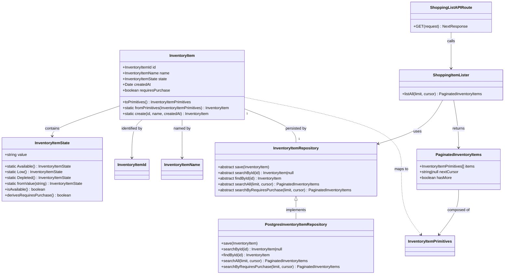

# [STORY-001-004] Shopping List API Endpoint - Implementation Guide

## Requirements

Implement a dedicated API endpoint to retrieve inventory items requiring purchase, providing users with an optimized shopping list view. The endpoint must automatically filter products marked as Low or Depleted (requires_purchase: true), support infinite scroll pagination via cursor-based navigation, maintain alphabetical ordering, and return consistent pagination metadata. This specialized view complements existing inventory state transition actions (replenish, mark-low, deplete) by closing the inventory management cycle with a purchase-focused interface.

## Entities



## Approach

### 1. Solution Architecture
Implement a filtered query pattern following hexagonal architecture principles:
- **Use Case Separation**: Create dedicated `ShoppingItemLister` application service following one-use-case-per-class pattern (same as InventoryItemLister, InventoryItemCreator, InventoryItemReplenisher)
- **Repository Extension**: Add new `searchByRequiresPurchase()` method to maintain semantic clarity ("all items" vs. "items requiring purchase")
- **Database-Level Filtering**: Apply WHERE clause before cursor comparison to ensure pagination works correctly over filtered subset
- **API Layer**: New dedicated route at `/api/inventory/shopping-list` with consistent error handling and response format

### 2. Technical Implementation
- **Framework**: Next.js 16.1.1 with TypeScript 5.9.3
- **Dependency Injection**: DIOD 3.0.0 with `@Service()` decorators and `registerAndUse()` pattern
- **Database**: PostgreSQL with existing composite index on `(name, created_at)`
- **Pagination**: Cursor-based using base64-encoded JSON tokens with limit validation (1-100, default 20)
- **Validation**: Zod 4.1.12 for input validation if needed, though type safety from TypeScript covers most cases
- **Error Handling**: Specific handling for `InvalidCursorError` (400 Bad Request), propagate unexpected errors to global handler

### 3. Business Logic
- **Filtering Invariant**: Only return items where `requires_purchase = true` (derived from state being Low or Depleted)
- **Pagination Consistency**: Cursor pagination must work correctly across filtered results - filter applies before cursor evaluation
- **Alphabetical Ordering**: Items ordered by `name ASC, created_at ASC` maintained from existing implementation
- **State-Purchase Relationship**: `requires_purchase` flag is derived from state via `InventoryItemState.derivesRequiresPurchase()` (Available → false, Low/Depleted → true)
- **Edge Cases**: Empty shopping list returns `{items: [], nextCursor: null, hasMore: false}` (HTTP 200, not 404)

## Structure

### Inheritance Relationships
1. **PostgresInventoryItemRepository extends PostgresRepository<InventoryItem>** - Base repository with SQL execution capabilities
2. **PostgresInventoryItemRepository implements InventoryItemRepository** - Repository interface contract
3. **InventoryItem extends AggregateRoot** - Domain aggregate with event publishing capabilities
4. **InvalidCursorError extends CodelyError** - Custom exception for cursor validation failures

### Dependencies
1. **ShoppingListAPIRoute → ShoppingItemLister → PostgresInventoryItemRepository** - Request flow from API to database
2. **ShoppingItemLister depends on InventoryItemRepository** - Abstract repository dependency for testability
3. **PostgresInventoryItemRepository depends on PostgresConnection** - Shared database connection
4. **ShoppingListAPIRoute injects ShoppingItemLister from DIOD container** - Dependency injection pattern

### Layered Architecture
1. **API Layer** (`src/app/api/inventory/shopping-list/route.ts`): HTTP request handling, query parameter parsing, response serialization via HttpNextResponse
2. **Application Layer** (`src/contexts/inventory/inventory-items/application/shopping-list/ShoppingItemLister.ts`): Use case orchestration, input validation (limit 1-100, default 20), delegation to repository
3. **Domain Layer** (`src/contexts/inventory/inventory-items/domain/InventoryItemRepository.ts`): Repository interface definition with new method signature
4. **Infrastructure Layer** (`src/contexts/inventory/inventory-items/infrastructure/PostgresInventoryItemRepository.ts`): SQL query implementation with WHERE clause filtering, cursor pagination logic
5. **Dependency Injection** (`src/contexts/shared/infrastructure/dependency-injection/diod.config.ts`): Service registration with `@Service()` decorator and `registerAndUse()` pattern

## Operations

### Extend Domain Interface - InventoryItemRepository
1. **Responsibility**: Define contract for searching items requiring purchase
2. **Location**: `src/contexts/inventory/inventory-items/domain/InventoryItemRepository.ts`
3. **Method Signature**: `abstract searchByRequiresPurchase(limit: number, cursor: string | null): Promise<PaginatedInventoryItems>`
4. **Semantics**: Explicit method for filtered search, maintains semantic separation from `searchAll()`
5. **Return Type**: PaginatedInventoryItems interface with items array, nextCursor, and hasMore boolean

### Implement Repository Method - PostgresInventoryItemRepository.searchByRequiresPurchase()
1. **Location**: `src/contexts/inventory/inventory-items/infrastructure/PostgresInventoryItemRepository.ts`
2. **Method**: `async searchByRequiresPurchase(limit: number, cursor: string | null): Promise<PaginatedInventoryItems>`
3. **Input Validation**:
   - Validate limit between 1-100, default to 20: `const validatedLimit = typeof limit === "number" && limit >= 1 && limit <= 100 ? limit : 20;`
   - Fetch `limit + 1` items to determine if more pages exist: `const fetchLimit = validatedLimit + 1;`
4. **SQL Query Logic**:
   - **No cursor case**:
     ```sql
     SELECT * FROM inventory.inventory_items
     WHERE requires_purchase = true
     ORDER BY name ASC, created_at ASC
     LIMIT ${fetchLimit}
     ```
   - **With cursor case**:
     ```sql
     SELECT * FROM inventory.inventory_items
     WHERE requires_purchase = true
       AND (name > ${decodedCursor.name} OR (name = ${decodedCursor.name} AND created_at > ${decodedCursor.createdAt}))
     ORDER BY name ASC, created_at ASC
     LIMIT ${fetchLimit}
     ```
   - **Cursor Decoding**: `const decodedCursor = Cursor.decode(cursor);` wrapped in try-catch for InvalidCursorError propagation
5. **Edge Case Handling**:
   - Empty result: `if (items.length === 0) return emptyPaginatedInventoryItems();`
   - More items exist: Remove last item, create cursor from it, return `hasMore: true`
   - Last page: Return all items with `nextCursor: null, hasMore: false`
6. **Consistency Check**: Ensure `nextCursor` is null when `hasMore` is false via `createPaginatedInventoryItems()` factory
7. **Performance**: Leverages existing composite index on `(name, created_at)` for efficient filtering and sorting

### Create Application Service - ShoppingItemLister
1. **Location**: `src/contexts/inventory/inventory-items/application/shopping-list/ShoppingItemLister.ts`
2. **Annotation**: `@Service()` decorator for DIOD registration
3. **Constructor Injection**: `constructor(private readonly repository: InventoryItemRepository) {}`
4. **Core Method**: `async listAll(limit: number = 20, cursor: string | null = null): Promise<PaginatedInventoryItems>`
5. **Input Validation**:
   - Parse and validate limit: `const validatedLimit = typeof limit === "number" && limit >= 1 && limit <= 100 ? limit : 20;`
   - Cursor validation delegated to repository layer
6. **Business Logic**: Single delegation call to repository: `return await this.repository.searchByRequiresPurchase(validatedLimit, cursor);`
7. **Error Propagation**: Allow InvalidCursorError and other exceptions to propagate to API layer
8. **Return Value**: PaginatedInventoryItems interface with items, nextCursor, and hasMore fields

### Register Service in DI Container
1. **Location**: `src/contexts/shared/infrastructure/dependency-injection/diod.config.ts`
2. **Import**: Add `import { ShoppingItemLister } from "../../../inventory/inventory-items/application/shopping-list/ShoppingItemLister";`
3. **Registration**: Add `builder.registerAndUse(ShoppingItemLister);` in Inventory Items section (after InventoryItemDepleter)
4. **Pattern**: Use `registerAndUse()` for concrete class registration (same as other inventory services)

### Create API Route - GET /api/inventory/shopping-list
1. **Location**: `src/app/api/inventory/shopping-list/route.ts`
2. **Required Import**: `import "reflect-metadata";` at top of file for DIOD metadata reflection
3. **Dependencies**: Import ShoppingItemLister, InvalidCursorError, HttpNextResponse, container
4. **Service Injection**: `const lister = container.get(ShoppingItemLister);`
5. **Handler Signature**: `export async function GET(request: NextRequest): Promise<NextResponse>`
6. **Query Parameter Parsing**:
   ```typescript
   const searchParams = request.nextUrl.searchParams;
   const limitParam = searchParams.get("limit");
   const cursor = searchParams.get("cursor");
   ```
7. **Limit Validation**:
   ```typescript
   let limit: number;
   if (limitParam === null || limitParam === "") {
       limit = 20;
   } else {
       const parsed = Number.parseInt(limitParam, 10);
       limit = Number.isNaN(parsed) ? 20 : parsed;
   }
   ```
8. **Business Logic Call**: `const paginatedItems = await lister.listAll(limit, cursor);`
9. **Success Response**: `return HttpNextResponse.ok(paginatedItems);` (HTTP 200)
10. **Error Handling**:
    - **InvalidCursorError**: `return HttpNextResponse.badRequest("Invalid cursor provided");` (HTTP 400)
    - **Unexpected errors**: `throw error;` to propagate to global error handler (HTTP 500)
11. **Response Format**: JSON object with `{items: [...], nextCursor: "...", hasMore: true/false}`

### Exception Handling - InvalidCursorError
1. **Existing Exception**: Reuse `InvalidCursorError` from `src/contexts/inventory/inventory-items/domain/InvalidCursorError.ts`
2. **Throw Condition**: When `Cursor.decode()` fails due to malformed base64 or invalid JSON structure
3. **API Handling**: Catch in GET handler, return 400 Bad Request with clear message
4. **Global Fallback**: Unexpected errors propagate to global handler for consistent error responses

## Norms

1. **Annotation Standards**:
   - Application services must use `@Service()` decorator for DIOD registration
   - API routes must include `import "reflect-metadata";` at top of file
   - Repository implementations use `@Service()` decorator for dependency injection

2. **Dependency Injection**:
   - Use DIOD ContainerBuilder pattern with `registerAndUse()` for concrete classes
   - Constructor injection for repository dependencies in application services
   - Service retrieval via `container.get(ServiceClass)` in API routes
   - Register services in `diod.config.ts` following domain context grouping

3. **Exception Handling**:
   - **InvalidCursorError**: Specific business exception for malformed pagination tokens
   - **CodelyError base class**: Custom exceptions extend CodelyError for consistent error structure
   - **API layer handling**: Catch specific exceptions (InvalidCursorError) and return appropriate HTTP status codes
   - **Global handler**: Propagate unexpected errors to global error handler for consistent 500 responses
   - **Error responses**: Use HttpNextResponse.badRequest() for client errors (4xx)
   - **No silent failures**: All exceptions must be handled or explicitly propagated

4. **Data Validation**:
   - Limit validation: 1-100 range, default to 20 for invalid or missing values
   - Cursor validation: Delegated to repository layer, throws InvalidCursorError for malformed tokens
   - Type safety: TypeScript strict mode with explicit function return types
   - Null handling: Explicit null checks for optional cursor parameter

5. **Logging Standards**:
   - Use existing logging infrastructure if available (not specified in current architecture)
   - Log pagination edge cases (empty results, cursor decoding failures) if debugging is needed
   - No sensitive data in logs (cursor tokens are opaque but encode timestamps)

6. **Documentation Standards**:
   - JSDoc comments for public methods in application services
   - Inline comments for complex SQL query logic (especially WHERE clause with cursor comparison)
   - Clear variable naming (validatedLimit, fetchLimit, decodedCursor)
   - Edge case handling documented in code comments

7. **Code Style**:
   - Follow `eslint-config-codely` preset
   - Explicit function return types enforced: `error`
   - TypeScript strict mode with decorators enabled
   - Consistent import ordering: reflect-metadata, Next.js, domain, infrastructure, shared

## Safeguards

1. **Functional Constraints**:
   - **Filtering invariant**: Shopping list MUST only contain items where `requires_purchase = true` (enforced at database layer via WHERE clause)
   - **Scope limitation**: Endpoint returns only items requiring purchase, not all inventory items
   - **No modification**: GET request is read-only, modifications use existing endpoints (replenish, mark-low, deplete)
   - **No redundant data**: Response includes requires_purchase field (true for all items) - accepted as consistency with existing APIs

2. **Performance Constraints**:
   - **Index usage**: Must leverage existing composite index on `(name, created_at)` for efficient filtering and sorting
   - **Query performance**: Pagination query with WHERE clause must be tested with EXPLAIN ANALYZE to verify index usage
   - **Partial index consideration**: If performance degrades, consider creating partial index: `CREATE INDEX idx_shopping_list ON inventory.inventory_items (name, created_at) WHERE requires_purchase = true;`
   - **Fetch limit optimization**: Use `limit + 1` pattern to determine hasMore without additional query

3. **Security Constraints**:
   - **SQL injection**: Use parameterized queries via postgres package template literals
   - **Cursor opacity**: Cursors are base64-encoded tokens, should not expose internal database structure
   - **Input sanitization**: Limit parameter validated to prevent excessive resource consumption
   - **No authentication**: This endpoint follows existing pattern (no auth specified in current architecture)

4. **Integration Constraints**:
   - **Backward compatibility**: New repository method does not break existing InventoryItemLister functionality
   - **Interface consistency**: Returns same PaginatedInventoryItems interface as existing list endpoints
   - **Database schema**: Assumes `requires_purchase` column exists (created by STORY-001-002 state transitions)
   - **No breaking changes**: Existing API routes remain unchanged

5. **Business Rule Constraints**:
   - **State-purchase relationship**: `requires_purchase` flag is derived from state, not independently modifiable
   - **State transitions**: Only state transition services (Replenisher, LowMarker, Depleter) can modify requires_purchase flag
   - **Alphabetical ordering**: Must be maintained as `name ASC, created_at ASC` regardless of filtering
   - **Pagination correctness**: Cursor must skip non-matching items transparently (AC7 requirement)

6. **Exception Handling Constraints**:
   - **InvalidCursorError**: Must be caught and return 400 Bad Request with clear message
   - **Empty results**: Must return 200 OK with empty items array, not 404 Not Found
   - **Unexpected errors**: Must propagate to global handler, not caught silently
   - **Error message clarity**: Bad request messages must be user-facing and descriptive

7. **Technical Constraints**:
   - **PostgreSQL version**: Assumes PostgreSQL with TIMESTAMPTZ support for created_at column
   - **Index granularity**: Assumes sufficient timestamp granularity to avoid duplicate (name, created_at) pairs
   - **Base64 encoding**: Assumes UTF-8 encoding for cursor token serialization
   - **Transaction management**: Read-only query does not require transaction boundaries

8. **Data Constraints**:
   - **Limit range**: 1-100 items per page, enforced at application and repository layers
   - **Cursor format**: Must be valid base64-encoded JSON with name and createdAt fields
   - **Name uniqueness**: Composite key (name, created_at) allows duplicate names with different timestamps
   - **Timestamp format**: ISO 8601 string in UTC timezone for createdAt field

9. **API Constraints**:
   - **HTTP method**: GET only (read-only resource)
   - **Response format**: JSON with PaginatedInventoryItems structure
   - **Status codes**: 200 OK for success, 400 Bad Request for invalid cursor, 500 for unexpected errors
   - **Content-Type**: application/json
   - **CORS**: Follow existing Next.js API route CORS configuration

10. **Testing Constraints**:
    - **AC1-AC7 coverage**: All acceptance criteria must be covered by integration tests
    - **AC7 emphasis**: Cursor behavior with filtered items must be tested explicitly
    - **Edge cases**: Empty list, single item, cursor from stale state
    - **Performance testing**: Query execution time with large datasets (1000+ items)
